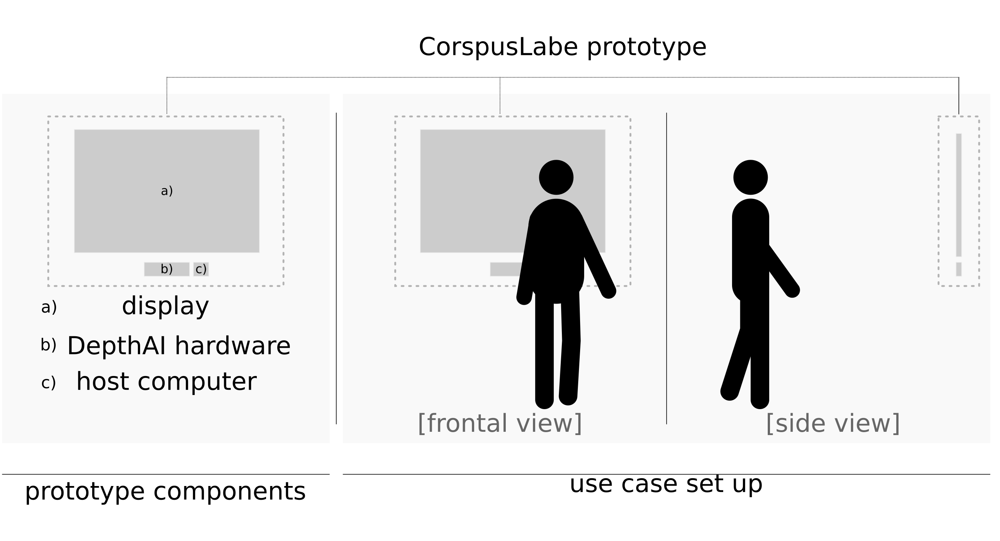
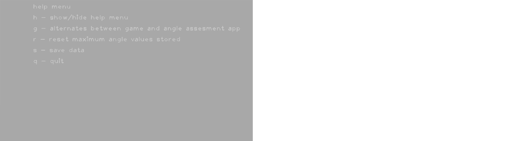
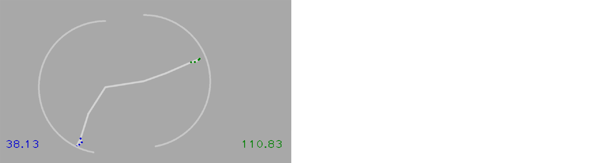
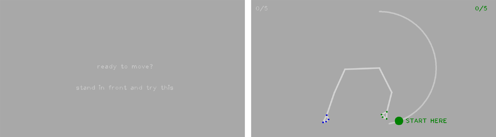
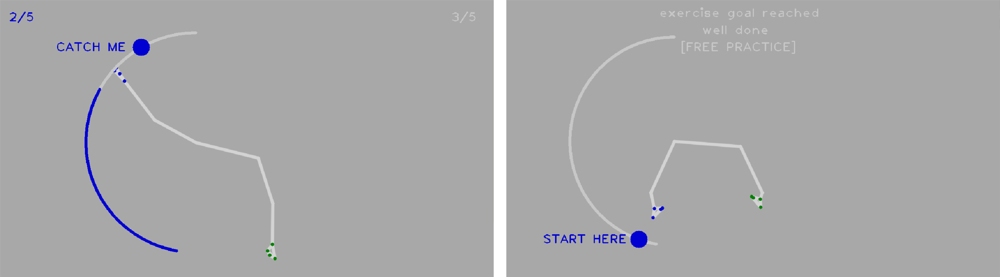

# corpusLabe prototype

Within the context of the [2021 OpenCV AI Competition](https://opencv.org/opencv-ai-competition-2021/), the corpusLabe prototype was developed by the team [Brighter Eyes Lynxes](https://brightereyeslynxes.github.io/) exploring the use of the OpenCV AI Kit for clinical assessment of posture, as well as, a gamified exercise platform, running BlazePose (a Google Mediapipe single body pose tracking model) on DepthAI hardware.



## Install

Install the python required packages with the following command:

```python3 -m pip install -r requirements.txt```

## Run

**Usage:**

```
> python corpusLabe.py 
```

## corpusLabe prototype help menu



## corpusLabe prototype as a virtual goniometer



## corpusLabe prototype as a gamified exercise platform





## Credits
* [Google Mediapipe](https://github.com/google/mediapipe)
* [Luxonis](https://github.com/luxonis/depthai-python)
* [OpenCV](https://opencv.org/)

and very special thanks to

* [geaxgx](https://github.com/geaxgx), whose repository [depthai_blazepose](https://github.com/geaxgx/depthai_blazepose) demonstrating the use of the BlazePose model on DepthAI hardware constitutes the very foundation of the implementation of this idea.
